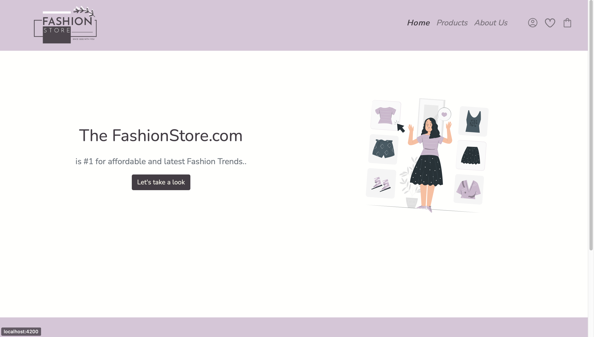
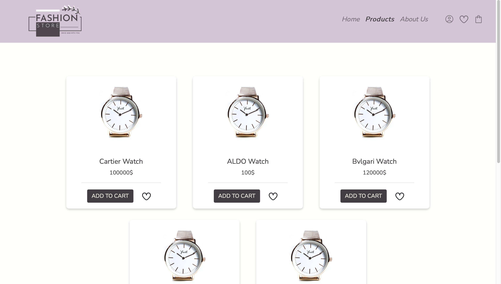
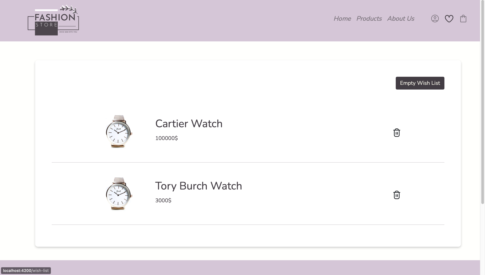
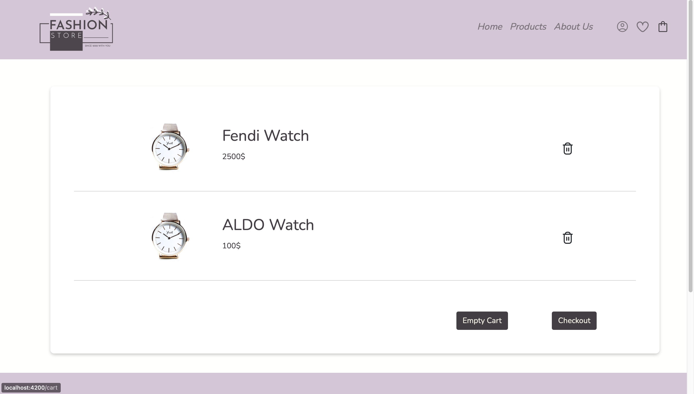
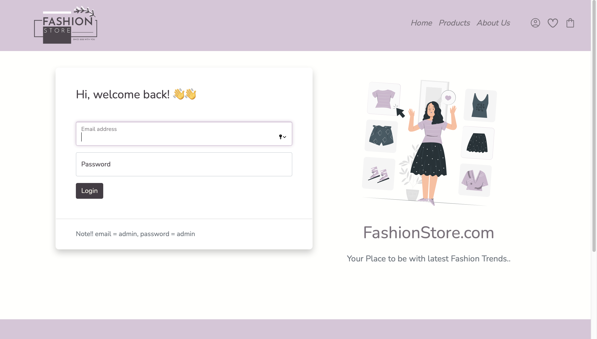
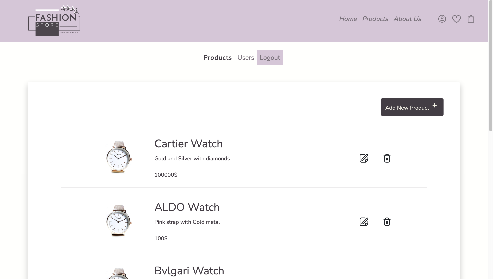
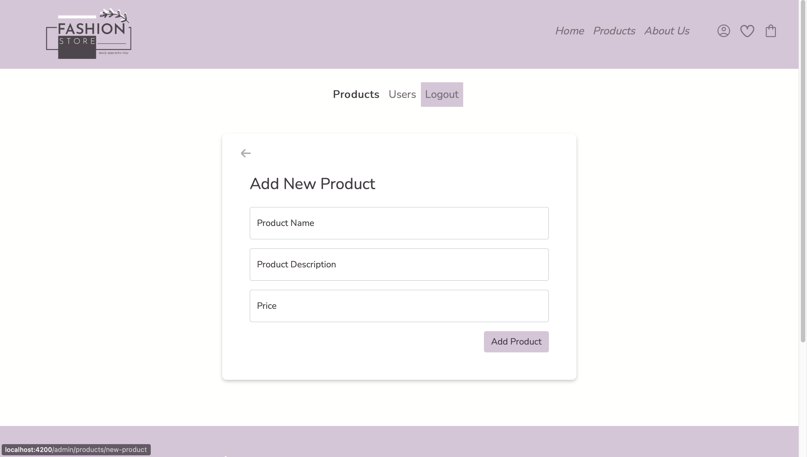
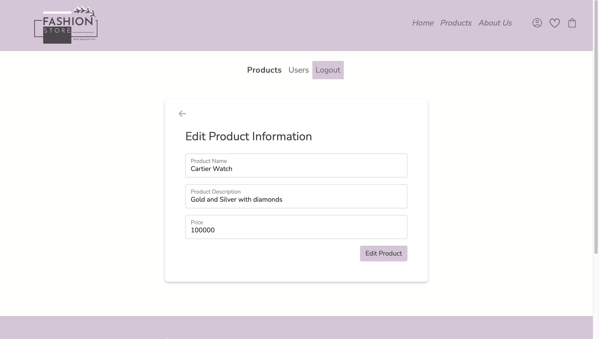
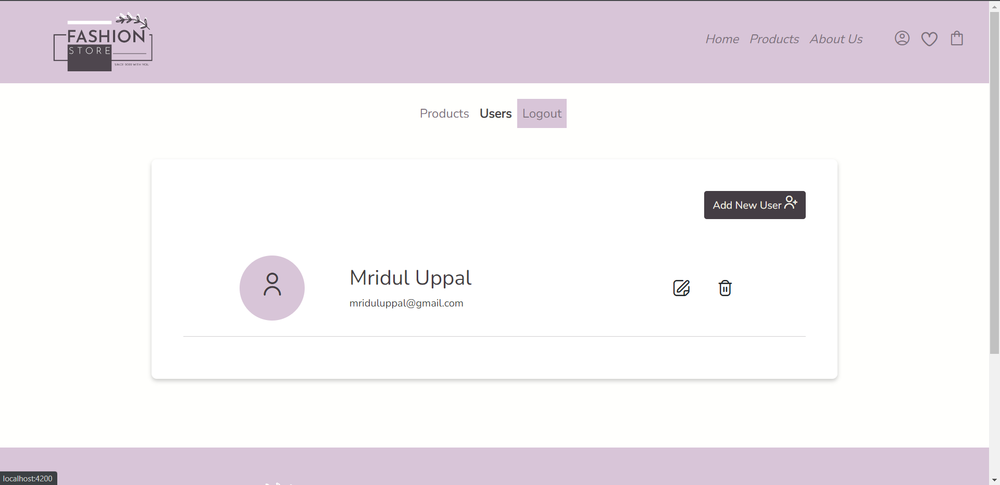
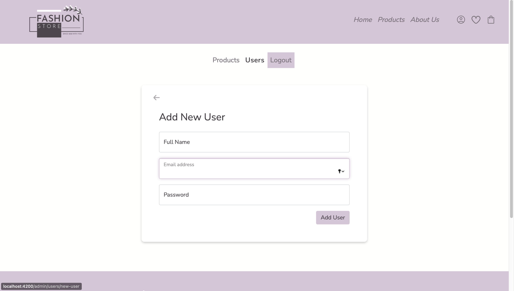

# SimpliLearn MEAN Stack Developer Bootcamp (Capstone Project) - Fashionista Application
Create a website that deal with online shopping for fashion goods and accessories.  

# Implementation requirements:
* Create a rich frontend.
* Create admin and user portals.
* Create functionalities for admin portal such as adding, updating, and deleting an item and user.
* Create functionalities for user portal such as, registration, sign in, purchasing item, adding to the cart, and wish listing items.
* Create database for storing all application related information.
 
# The following tools must be used:
VS Code, Angular, NodeJS, MongoDB, AWS cloud services for deploying the application.

# Screenshots 
## Users Side
**Home Page

**Products Page

**Wish List Page

**Cart Page

## Admin Side
**Login Page

**Products Page

**Add new Product Page

**Edit Product Page

**Users Page

**Add new User Page

## Running steps (on terminal)
First run the backend
1. `cd backend`
2. `npm install`
3. `npm start`

Second run the frontend
1. `cd fashionista`
2. `npm install`
3. `npm start`

Third discover Fashionista app

a. Admin
1. Paste this url in browser http://localhost:4200/admin
2. Login by username 'admin' and password 'admin'

b. User
1. Paste this url in browser http://localhost:4200
2. You can create account or login

## The app provide these services
a. Admin 
1. You can manage products and users by add, update and delete

b. User
1. You can create account or login
2. Add products to wish list and cart
3. Manage wish list and cart by delete all products or selected ones
